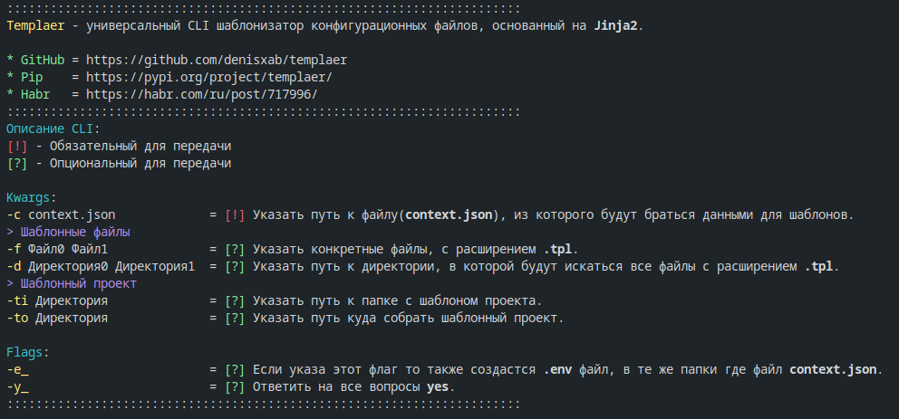

# Templaer

`Templaer` - универсальный CLI шаблонизатор конфигурационных файлов, основанный на `Jinja2`.

- GitHub - <https://github.com/denisxab/templaer>
- Pip - <https://pypi.org/project/templaer/>
- Habr - <https://habr.com/ru/post/717996/>




## Аналоги

Существует множество инструментов, основанных на `Jinja2`, которые можно использовать для шаблонизации конфигурационных файлов через `CLI`. Вот несколько примеров:

- `j2cli`: это инструмент командной строки, который позволяет использовать Jinja2 для создания конфигурационных файлов. Он может принимать данные из файлов или стандартного ввода и применять их к шаблонам, включая конфигурационные файлы.
- `cookiecutter`: это инструмент командной строки, который использует Jinja2 для генерации проектных шаблонов. Он также может использоваться для создания конфигурационных файлов. cookiecutter может быть установлен через pip.
- `ansible`: это инструмент автоматизации, который использует Jinja2 для шаблонизации конфигурационных файлов и других файлов, используемых в автоматизации. ansible может быть установлен через pip.
- `SaltStack`: это инструмент автоматизации, который использует Jinja2 для шаблонизации конфигурационных файлов и других файлов, используемых в автоматизации. SaltStack также может быть установлен через pip.
- `mustpl` : <https://habr.com/ru/post/684898/>

Я создал `Templaer` потому что им удобнее пользоваться, и так как он на `Python`, его можно гибко кастомизировать. Если вам нравиться использовать другие шаблонизаторы конфигураций, то используйте их.

## Установка

1. Установить `templaer`

    ```bash
    pip install templaer
    ```

2. Получить подсказку по `CLI`

    ```bash
    python -m templaer
    ```

> Можете создать алиас в `.bashrc`/`.zshrc` для этой команды
>
> ```bash
> alias templaer="python -m templaer"
> ```

## Примеры CLI

### Шаблонные файлы

В файле `context.jsonc` хранятся данные для шаблонов, в нем можно использовать комментарии `//`.

В простом варианте это может быть словарь. Ключ - это имя переменной, значение ключа - это значение переменной.

```jsonc
{
    // Режим разработчика
    "DEBUG": false,
    // Порт для дебага
    "PORT_D": 8080,
    // Порт для релиза
    "PORT_R": 80
}
```

Пример шаблонного файла. Предлагаю для них указывать расширение `.tpl`. В данном случае этот файл называется `nginx.conf.tpl`. Новый собранный файл не будет иметь расширение `.tpl`, и будет называться `nginx.conf`.

```nginx
server {
    listen {{ PORT_R }};
    server_name "localhost";

    location / {
        default_type text/html;
        return 200 'ok';
    }
}
```

- Собрать указанные файлы (можно указывать несколько файлов).

    ```bash
    python -m templaer -c context.jsonc -f Файл0.conf.tpl Файл1.tpl
    ```

- Поиск в указанной директории всех файлов, которые оканчиваются на .tpl, и сборка этих файлов (можно указывать несколько директорий).

    ```bash
    python -m templaer -c context.jsonc -d Папка  
    ```

- Часто бывает нужно чтобы данные хранились в `.env` файле, например это нужно для `Docker`. И чтобы не держать две копии данных в `context.jsonc` и `.env` файлах. Можно указать флаг `-e_` - тогда он создаст `.env` файл на основе `context.jsonc` и поместит его в туже папку где и `context.jsonc`.

    ```bash
    python -m templaer -c context.jsonc -f Файл.conf.tpl -e_
    ```

### Шаблонные проекты

Часто бывает нужно создать проект по какому-то шаблону. В таких шаблонах обычно есть папки, есть файлы с шаблонным текстом, который может быть изменен, в зависимости от контекста, и какие-то бинарные файлы.

Для того чтобы использовать шаблонный проект - его нужно создать.

Пример шаблонного проекта, создаем папку `ШаблонПроекта` со следующем содержанием:

```markdown
- ШаблонПроекта/
  - manage.py.tpl
  - Dockerfile.tpl
  - requirements.txt
  - api/
    - urls.py
    - views.py
  - conf/
    - settings.py.tpl
    - asgi.py
    - urls.py
```

Для того чтобы собрать проект по шаблону, нужно использовать команду:

```bash
python -m templaer -c context.jsonc -ti ШаблонПроекта -to ПапкаКудаСобрать 
```

В итоге создастся новый проект, в папке `ПапкаКудаСобрать`. В него копируются все файлы и папки из `ШаблонПроекта`, и в нем же будут собраны шаблонные файлы, на основе `context.jsonc`.

```markdown
- ПапкаКудаСобрать/
  - manage.py.tpl
  - manage.py
  - Dockerfile.tpl
  - Dockerfile
  - requirements.txt
  - api/
    - urls.py
    - views.py
  - conf/
    - settings.py.tpl
    - settings.py
    - asgi.py
    - urls.py
```

Если вы попробуете заново собрать проект в туже папку, то тогда программа в интерактивном режиме будут запрашивать подтверждение на перезапись файлов, которые отличаются от шаблона. Если вы хотите заранее ответить на все вопросы `Yes`, то укажите флаг `-y_`

```bash
python -m templaer -c context.jsonc -ti ШаблонПроекта -to ПапкаКудаСобрать -y_
```

> .
> **[Список всех готовых шаблонов](#готовые-шаблоны-проектов)**
> .
>
## Основы шаблонов на Jinja2

### Тернарный условный оператор

В этом примере показано как в зависимости от переменной `DEBUG`, будет поставлено значение из переменной `PORT_D` или `PORT_R`.

1. Содержание файла `context.jsonc`:

    ```json
    {
        "DEBUG": false,
        "PORT_D": 8080,
        "PORT_R": 80
    }
    ```

2. Содержание файла `ЛюбойФайл.conf.tpl`:

    ```nginx
    server {
        listen {{ PORT_D if DEBUG else PORT_R }};
        server_name "localhost";

        location / {
            default_type text/html;
            return 200 'ok';
        }
    }
    ```

3. Соберем файл используя команду:

    ```bash
    python -m templaer -c context.jsonc -f ЛюбойФайл.conf.tpl
    ```

4. В итоге создастся(или перезапишитесь) новый файл `ЛюбойФайл.conf`, с содержанием:

    ```nginx
    server {
        listen 80;
        server_name "localhost";

        location / {
            default_type text/html;
            return 200 'ok';
        }
    }
    ```

# Готовые шаблоны проектов

`Templaer` удобно использовать для кастомной шаблонизации проектов. В этой главе собраны инструкции как создать, и запустить проект, из шаблона.

## Django REST + PostgreSQL + Nginx + Docker

1. Собрать проект для `Django`:

    ```bash
    templaer -e_                                     \
        -c  ./st/django_project/пример_context.jsonc \
        -ti ./st/django_project                      \
        -to ПапкаКудаСобрать                  
    ```

2. Собрать и запустить контейнеры, через `docker-compose`:

    ```bash
    docker-compose build && docker-compose up
    ```

3. Создать и применить миграции в БД, и собрать статические файлы в Django:

    ```bash
    make docker_init_django
    ```

---

1. Собрать приложение для `Django`:

    ```bash
    templaer                    \
        -ti ./st/django_app     \
        -to ПапкаКудаСобрать                  
    ```
